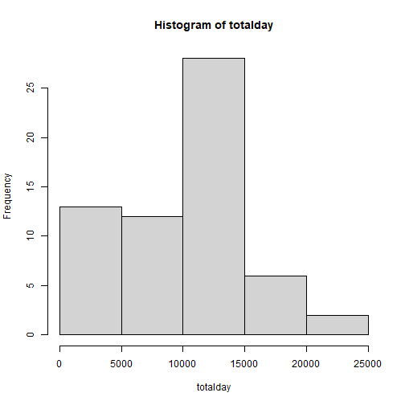
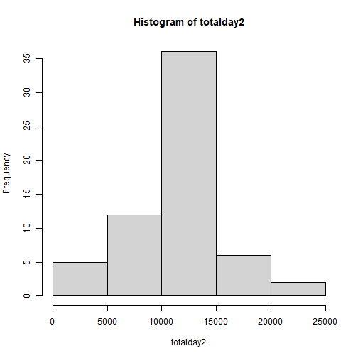
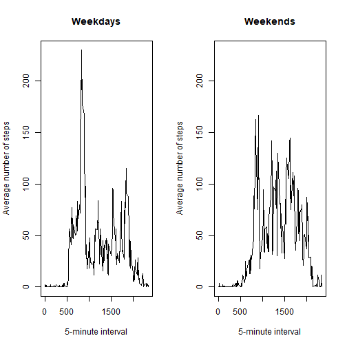

First, let's load the data:


```r
if (!file.exists("activity.csv")) unzip("activity.zip")
act <- read.csv("activity.csv")
```

1. What is mean total number of steps taken per day?


```r
totalday <- tapply(act$steps, act$date, sum, na.rm=TRUE)
hist(totalday)
```



```r
meanday <- tapply(act$steps, act$date, mean, na.rm=TRUE)
medianday <- tapply(act$steps, act$date, median, na.rm=TRUE)
meanday
```

```
## 2012-10-01 2012-10-02 2012-10-03 2012-10-04 2012-10-05 2012-10-06 2012-10-07 2012-10-08 
##        NaN  0.4375000 39.4166667 42.0694444 46.1597222 53.5416667 38.2465278        NaN 
## 2012-10-09 2012-10-10 2012-10-11 2012-10-12 2012-10-13 2012-10-14 2012-10-15 2012-10-16 
## 44.4826389 34.3750000 35.7777778 60.3541667 43.1458333 52.4236111 35.2048611 52.3750000 
## 2012-10-17 2012-10-18 2012-10-19 2012-10-20 2012-10-21 2012-10-22 2012-10-23 2012-10-24 
## 46.7083333 34.9166667 41.0729167 36.0937500 30.6284722 46.7361111 30.9652778 29.0104167 
## 2012-10-25 2012-10-26 2012-10-27 2012-10-28 2012-10-29 2012-10-30 2012-10-31 2012-11-01 
##  8.6527778 23.5347222 35.1354167 39.7847222 17.4236111 34.0937500 53.5208333        NaN 
## 2012-11-02 2012-11-03 2012-11-04 2012-11-05 2012-11-06 2012-11-07 2012-11-08 2012-11-09 
## 36.8055556 36.7048611        NaN 36.2465278 28.9375000 44.7326389 11.1770833        NaN 
## 2012-11-10 2012-11-11 2012-11-12 2012-11-13 2012-11-14 2012-11-15 2012-11-16 2012-11-17 
##        NaN 43.7777778 37.3784722 25.4722222        NaN  0.1423611 18.8923611 49.7881944 
## 2012-11-18 2012-11-19 2012-11-20 2012-11-21 2012-11-22 2012-11-23 2012-11-24 2012-11-25 
## 52.4652778 30.6979167 15.5277778 44.3993056 70.9270833 73.5902778 50.2708333 41.0902778 
## 2012-11-26 2012-11-27 2012-11-28 2012-11-29 2012-11-30 
## 38.7569444 47.3819444 35.3576389 24.4687500        NaN
```

```r
medianday
```

```
## 2012-10-01 2012-10-02 2012-10-03 2012-10-04 2012-10-05 2012-10-06 2012-10-07 2012-10-08 
##         NA          0          0          0          0          0          0         NA 
## 2012-10-09 2012-10-10 2012-10-11 2012-10-12 2012-10-13 2012-10-14 2012-10-15 2012-10-16 
##          0          0          0          0          0          0          0          0 
## 2012-10-17 2012-10-18 2012-10-19 2012-10-20 2012-10-21 2012-10-22 2012-10-23 2012-10-24 
##          0          0          0          0          0          0          0          0 
## 2012-10-25 2012-10-26 2012-10-27 2012-10-28 2012-10-29 2012-10-30 2012-10-31 2012-11-01 
##          0          0          0          0          0          0          0         NA 
## 2012-11-02 2012-11-03 2012-11-04 2012-11-05 2012-11-06 2012-11-07 2012-11-08 2012-11-09 
##          0          0         NA          0          0          0          0         NA 
## 2012-11-10 2012-11-11 2012-11-12 2012-11-13 2012-11-14 2012-11-15 2012-11-16 2012-11-17 
##         NA          0          0          0         NA          0          0          0 
## 2012-11-18 2012-11-19 2012-11-20 2012-11-21 2012-11-22 2012-11-23 2012-11-24 2012-11-25 
##          0          0          0          0          0          0          0          0 
## 2012-11-26 2012-11-27 2012-11-28 2012-11-29 2012-11-30 
##          0          0          0          0         NA
```

2. What is the average daily activity pattern?


```r
y <- tapply(act$steps, act$interval, mean, na.rm=TRUE)
plot(unique(act$interval), y, type="l", xlab="5-minute interval", ylab="Average number of steps")
```


```r
a <- names(y[which.max(y)])
```

The 5-minute interval with the maximun numbers of steps is the interval 835.

3. Imputing missing values


```r
act2 <- act
datamissing <- act2[is.na(act$steps),]
nmissing <- nrow(datamissing)
for (i in 1:nmissing) {
    datamissing[i,"steps"] <- y[as.character(datamissing[i,"interval"])]
}
act2[is.na(act2$steps),"steps"] <- datamissing$steps
```

The total number of missing values is 2304.  
For filling in all of the missing values it was used the mean for that 5-minute interval.


```r
totalday2 <- tapply(act2$steps, act2$date, sum)
hist(totalday2)
```



```r
meanday2 <- tapply(act2$steps, act2$date, mean)
medianday2 <- tapply(act2$steps, act2$date, median)
meanday2
```

```
## 2012-10-01 2012-10-02 2012-10-03 2012-10-04 2012-10-05 2012-10-06 2012-10-07 2012-10-08 
## 37.3825996  0.4375000 39.4166667 42.0694444 46.1597222 53.5416667 38.2465278 37.3825996 
## 2012-10-09 2012-10-10 2012-10-11 2012-10-12 2012-10-13 2012-10-14 2012-10-15 2012-10-16 
## 44.4826389 34.3750000 35.7777778 60.3541667 43.1458333 52.4236111 35.2048611 52.3750000 
## 2012-10-17 2012-10-18 2012-10-19 2012-10-20 2012-10-21 2012-10-22 2012-10-23 2012-10-24 
## 46.7083333 34.9166667 41.0729167 36.0937500 30.6284722 46.7361111 30.9652778 29.0104167 
## 2012-10-25 2012-10-26 2012-10-27 2012-10-28 2012-10-29 2012-10-30 2012-10-31 2012-11-01 
##  8.6527778 23.5347222 35.1354167 39.7847222 17.4236111 34.0937500 53.5208333 37.3825996 
## 2012-11-02 2012-11-03 2012-11-04 2012-11-05 2012-11-06 2012-11-07 2012-11-08 2012-11-09 
## 36.8055556 36.7048611 37.3825996 36.2465278 28.9375000 44.7326389 11.1770833 37.3825996 
## 2012-11-10 2012-11-11 2012-11-12 2012-11-13 2012-11-14 2012-11-15 2012-11-16 2012-11-17 
## 37.3825996 43.7777778 37.3784722 25.4722222 37.3825996  0.1423611 18.8923611 49.7881944 
## 2012-11-18 2012-11-19 2012-11-20 2012-11-21 2012-11-22 2012-11-23 2012-11-24 2012-11-25 
## 52.4652778 30.6979167 15.5277778 44.3993056 70.9270833 73.5902778 50.2708333 41.0902778 
## 2012-11-26 2012-11-27 2012-11-28 2012-11-29 2012-11-30 
## 38.7569444 47.3819444 35.3576389 24.4687500 37.3825996
```

```r
medianday2
```

```
## 2012-10-01 2012-10-02 2012-10-03 2012-10-04 2012-10-05 2012-10-06 2012-10-07 2012-10-08 
##   34.11321    0.00000    0.00000    0.00000    0.00000    0.00000    0.00000   34.11321 
## 2012-10-09 2012-10-10 2012-10-11 2012-10-12 2012-10-13 2012-10-14 2012-10-15 2012-10-16 
##    0.00000    0.00000    0.00000    0.00000    0.00000    0.00000    0.00000    0.00000 
## 2012-10-17 2012-10-18 2012-10-19 2012-10-20 2012-10-21 2012-10-22 2012-10-23 2012-10-24 
##    0.00000    0.00000    0.00000    0.00000    0.00000    0.00000    0.00000    0.00000 
## 2012-10-25 2012-10-26 2012-10-27 2012-10-28 2012-10-29 2012-10-30 2012-10-31 2012-11-01 
##    0.00000    0.00000    0.00000    0.00000    0.00000    0.00000    0.00000   34.11321 
## 2012-11-02 2012-11-03 2012-11-04 2012-11-05 2012-11-06 2012-11-07 2012-11-08 2012-11-09 
##    0.00000    0.00000   34.11321    0.00000    0.00000    0.00000    0.00000   34.11321 
## 2012-11-10 2012-11-11 2012-11-12 2012-11-13 2012-11-14 2012-11-15 2012-11-16 2012-11-17 
##   34.11321    0.00000    0.00000    0.00000   34.11321    0.00000    0.00000    0.00000 
## 2012-11-18 2012-11-19 2012-11-20 2012-11-21 2012-11-22 2012-11-23 2012-11-24 2012-11-25 
##    0.00000    0.00000    0.00000    0.00000    0.00000    0.00000    0.00000    0.00000 
## 2012-11-26 2012-11-27 2012-11-28 2012-11-29 2012-11-30 
##    0.00000    0.00000    0.00000    0.00000   34.11321
```

These values differ from the estimates from the first part of the assignment, but the difference is small. Filling in the missing values results in greater values for the total, mean, and median steps in some days. Specially for the days with a greater proportion of missing values.

4. Are there differences in activity patterns between weekdays and weekends?


```r
act2$day <- weekdays(as.Date(act2$date))
act2$week <- as.factor(ifelse(act2$day=="sábado" | act2$day=="domingo", "weekend", "weekday"))
two <- split(act2, act2$week)
daymean <- tapply(two$weekday$steps, two$weekday$interval, mean)
endmean <- tapply(two$weekend$steps, two$weekend$interval, mean)
par(mfrow=c(1,2))
plot(unique(act2$interval), daymean, type="l", main="Weekdays", xlab="5-minute interval", ylab="Average number of steps", ylim=c(0,230))
plot(unique(act2$interval), endmean, type="l", main="Weekends", xlab="5-minute interval", ylab="Average number of steps", ylim=c(0,230))
```


